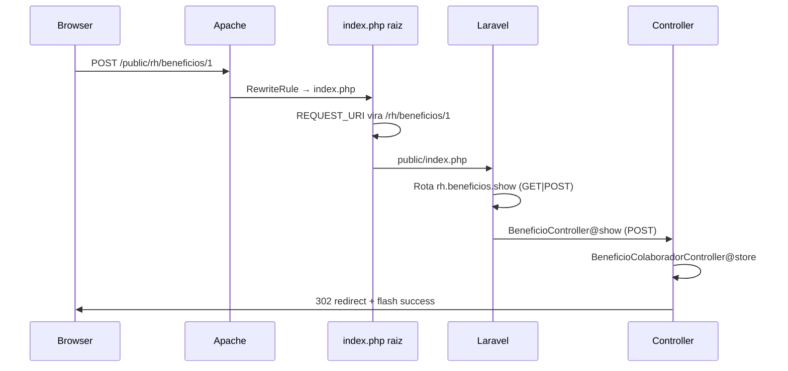

# Relatório técnico — 404 em Benefícios (produção)

**Projeto:** omegaadm / omega286  
**URL produção:** `https://omegaadm.feston.net.br/public/rh/beneficios/1`  
**URL localhost (funciona):** `http://127.0.0.1:2080/rh/beneficios/1`  
**Último commit relevante:** `4d9af71` (ver também `9dcada7`, `357dc19`, `ab62380`…)  
**Data do relatório:** maio/2026  

---

## 1. Resumo executivo

| Ambiente | GET tela benefício | POST Salvar/Excluir/Vincular |
|----------|-------------------|------------------------------|
| Localhost | OK | OK |
| Produção | Às vezes OK, depois **404** | **404** (`POST .../public/rh/beneficios/1`) |

**Não é problema de migration.** Se a listagem de colaboradores já apareceu, a tabela `colaborador_beneficios` existe.

**Causa raiz mais provável (para o dev validar):**

1. **Document root** no Hostinger aponta para a pasta do projeto (`omegaadm`), não para `omegaadm/public`.
2. A URL pública inclui o segmento **`/public/`**, mas o Laravel registra rotas como **`rh/beneficios/{id}`** (sem `public`).
3. O `index.php` na raiz recebia `REQUEST_URI=/public/rh/beneficios/1` → o router procurava rota `public/rh/...` → **404 Not Found** (página padrão Laravel).
4. `.htaccess` sozinho não corrige o path interno que o PHP/Laravel enxerga.

**Correção adicional neste relatório:** normalizar `REQUEST_URI` em `index.php` (raiz) removendo o prefixo `/public` antes do bootstrap.

**Correção estrutural recomendada (Hostinger):** definir **Document Root** = `.../omegaadm/public` para a URL ficar igual ao localhost (sem `/public` no navegador).

---

## 2. Sintoma atual (console do navegador)

```
POST https://omegaadm.feston.net.br/public/rh/beneficios/1 404 (Not Found)
```

- Erros `pinComponent.js`, `chrome-extension://` → **extensão do Chrome**, ignorar.
- A página de erro é **`404 | NOT FOUND`** (estilo Laravel), não página do Apache.

Isso indica que o PHP/Laravel **pode estar rodando**, mas **nenhuma rota bate** com o path recebido.

---

## 3. Diferença localhost × produção

```
LOCALHOST                          PRODUÇÃO (Hostinger)
─────────────────────────────      ─────────────────────────────────────
Document root: public/             Document root: omegaadm/ (raiz do repo)
URL: /rh/beneficios/1              URL: /public/rh/beneficios/1
Entry: public/index.php            Entry: index.php (raiz) → public/index.php
Path no Laravel: rh/beneficios/1   Path SEM fix: public/rh/beneficios/1  ← 404
```

---

## 4. Fluxo esperado (após correções de código)



---

## 5. Histórico de commits (Git)

| Commit | Descrição |
|--------|-----------|
| `3156c7f` | Fix inicial: HTML tabela, rotas colaboradores, binding `{vinculo}`, filtros |
| `7f4197e` | POST em produção (sem _method PUT/DELETE) |
| `cfe9b1c` | Rotas `/salvar`, `/excluir`, form sem `display:contents` |
| `ab62380` | POST via `vinculo_id` na rota `.../colaboradores` |
| `2e37d54` | Rotas `/vinculos` + `.htaccess` `/public/` |
| `357dc19` | POST na mesma URL `.../beneficios/{id}` |
| `9dcada7` | `Route::match get+post`, `request()->url()`, middleware `ForceRequestRootUrl` |
| `4d9af71` | Layout tabela restaurado + `.htaccess` não tratar `public/` como pasta estática de app |
| **(novo)** | `index.php` normaliza `/public` no REQUEST_URI + doc DEV |

Repositório: `https://github.com/dancacarajas/omegaadm` branch `main`.

---

## 6. Arquivos alterados (mapa para o dev)

| Arquivo | Função |
|---------|--------|
| `index.php` (raiz) | Remove prefixo `/public` de `REQUEST_URI` antes do Laravel |
| `.htaccess` (raiz) | Encaminha requisições ao `index.php`; arquivos estáticos em `public/` |
| `public/index.php` | Front controller padrão Laravel |
| `routes/web.php` | `Route::match(['get','post'], 'beneficios/{beneficio}', ...)` + rotas legado |
| `app/Http/Controllers/Rh/BeneficioController.php` | `show()` delega POST para `BeneficioColaboradorController@store` |
| `app/Http/Controllers/Rh/BeneficioColaboradorController.php` | `store()` com `vinculo_id` + `acao=salvar\|excluir` |
| `app/Providers/AppServiceProvider.php` | `Route::bind('vinculo', ...)` |
| `app/Http/Middleware/ForceRequestRootUrl.php` | `URL::forceRootUrl` com `/public` quando aplicável |
| `bootstrap/app.php` | Registra middleware `ForceRequestRootUrl` no grupo `web` |
| `resources/views/rh/beneficios/show.blade.php` | `$urlGestaoBeneficio = request()->url()`; forms POST na URL da tela |
| `tests/Feature/Rh/BeneficioColaboradorVinculoTest.php` | Testes de vincular, salvar, excluir, filtros |
| `scripts/atualizar-producao.sh` | Script deploy SSH |
| `docs/AUDITORIA_BENEFICIOS_PRODUCAO.md` | Resumo curto |

---

## 7. Rotas registradas (esperado após deploy)

Executar no servidor:

```bash
php artisan route:list --path=beneficios
```

Saída esperada (trecho):

```
GET|POST|HEAD   rh/beneficios/{beneficio}   rh.beneficios.show   BeneficioController@show
PUT|PATCH       rh/beneficios/{beneficio}   rh.beneficios.update
DELETE          rh/beneficios/{beneficio}   rh.beneficios.destroy
POST            rh/beneficios/{beneficio}/colaboradores   (legado)
POST            rh/beneficios/{beneficio}/vinculos         (legado)
...
```

**Importante:** o path interno deve ser `rh/beneficios/1`, **não** `public/rh/beneficios/1`.

---

## 8. Comportamento dos formulários (show.blade.php)

- Variável: `$urlGestaoBeneficio = request()->url();`  
  Ex.: `https://omegaadm.feston.net.br/public/rh/beneficios/1`
- **Vincular:** `POST` + `@csrf` → mesma URL.
- **Salvar / Excluir (por linha):** `POST` + `vinculo_id` + `acao=salvar` ou `acao=excluir` → mesma URL.
- Campos usam atributo `form="vinculo-form-{id}"` + `<form id="...">` na coluna Ações (HTML válido).

Controller (`BeneficioColaboradorController@store`):

```php
if ($request->filled('vinculo_id')) {
    // atualizar ou excluir (acao=excluir)
}
// senão: vincular novo colaborador (colaborador_id)
```

---

## 9. Checklist de diagnóstico no servidor

O usuário já está na pasta correta quando o SSH mostra `[us-phx-web556 omegaadm]$` (não usar `cd ~/omegaadm` se der “No such file”).

```bash
# 1. Confirmar pasta e commit
pwd
git rev-parse --short HEAD   # deve ser >= 4d9af71 (+ commit do index.php se já puxado)

# 2. Atualizar e limpar cache
git pull origin main
php artisan optimize:clear
php artisan route:clear
php artisan config:clear
php artisan view:clear

# 3. Rotas
php artisan route:list --path=beneficios

# 4. APP_URL
grep APP_URL .env

# 5. Teste HTTP pelo próprio servidor (substituir cookie de sessão se precisar auth)
curl -sI -X GET  "https://omegaadm.feston.net.br/public/rh/beneficios/1"
curl -sI -X POST "https://omegaadm.feston.net.br/public/rh/beneficios/1" \
  -H "Content-Type: application/x-www-form-urlencoded" \
  -d "_token=test"

# 6. Ver se é Apache ou LiteSpeed
php -i | grep -i "server_api"

# 7. OPcache (se POST continuar 404 com código novo)
# Reiniciar PHP / limpar opcache no painel Hostinger
```

### Resultados esperados

| Teste | OK | Problema |
|-------|-----|----------|
| GET `.../beneficios/1` → 200 | Laravel + path OK | 404 → path ou htaccess |
| POST → 302 ou 419 (CSRF) | Rota POST existe | 404 → rota/path; 419 → normal sem cookie |
| `route:list` mostra GET\|POST | Deploy OK | Código antigo ou cache |

---

## 10. Configuração `.env` produção

```env
APP_URL=https://omegaadm.feston.net.br/public
APP_ENV=production
APP_DEBUG=false   # true só temporariamente para ver stack trace
```

Se o document root for alterado para `public/`:

```env
APP_URL=https://omegaadm.feston.net.br
```

(URL **sem** `/public`).

---

## 11. Solução recomendada no Hostinger (definitiva infra)

1. hPanel → **Sites** → `omegaadm.feston.net.br` → **Avançado** → **Document Root**.
2. Apontar para: `/home/u482227589/.../omegaadm/public` (caminho real da pasta `public` do Laravel).
3. Acessar: `https://omegaadm.feston.net.br/rh/beneficios/1` (sem `/public`).
4. Ajustar `APP_URL` sem `/public`.
5. `php artisan config:clear`.

Isso alinha 100% com localhost e elimina hacks de `index.php` / `.htaccess`.

---

## 12. Se usar Nginx (não Apache)

O `.htaccess` **não funciona**. É necessário bloco no Nginx:

```nginx
location / {
    try_files $uri $uri/ /index.php?$query_string;
}
```

Ou document root = `public` com config padrão Laravel.

---

## 13. Deploy (comandos para o usuário)

```bash
# Já dentro de omegaadm (como no SSH do usuário)
git pull origin main
php artisan optimize:clear
php artisan route:clear
php artisan config:clear
php artisan view:clear
```

Teste em **aba anônima** após deploy.

---

## 14. Contato / reprodução local com prefixo /public

Para simular produção localmente:

```bash
# Servir a partir da raiz do projeto (não só public/)
php -S 127.0.0.1:8080 -t .
# Acessar: http://127.0.0.1:8080/public/rh/beneficios/1
```

Com o fix em `index.php`, deve comportar-se como produção corrigida.

---

## 15. Perguntas em aberto para o dev

1. O servidor é **Apache, LiteSpeed ou Nginx**?
2. O **document root** atual é `omegaadm` ou `omegaadm/public`?
3. Existe **`route:cache`** persistido ou deploy automático sem `route:clear`?
4. Outros módulos RH com **POST** em produção funcionam? (ex.: `rh/frequencia/...`) — se sim, comparar URL e htaccess.
5. Após `git pull`, o arquivo `index.php` na raiz contém o bloco que remove `/public` do `REQUEST_URI`?

---

*Documento gerado para handoff ao desenvolvedor. Atualizar este arquivo se a causa raiz for confirmada no servidor.*
