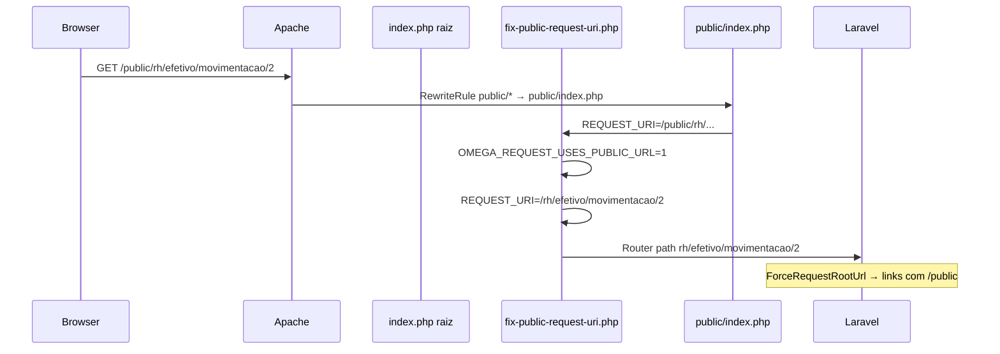

# Relatório técnico — 404 em Movimentações / botão Alterar (produção)

> **Leia primeiro:** [DEV_PRODUCAO_CAUSA_RAIZ_HOSTINGER.md](./DEV_PRODUCAO_CAUSA_RAIZ_HOSTINGER.md) — **Benefícios em produção já funciona**; use como referência e compare este módulo (não tratar como “ambiente inteiro quebrado”).

**Projeto:** omegaadm / omega286  
**URL canônica (após fix):** `https://omegaadm.feston.net.br/public/rh/movimentacao/2`  
**Legado (301):** `/public/rh/efetivo/movimentacao/2` → canônica  
**URL localhost:** `http://127.0.0.1:2080/rh/movimentacao/2`  
**Documento relacionado:** [DEV_BENEFICIOS_404_PRODUCAO.md](./DEV_BENEFICIOS_404_PRODUCAO.md) (mesmo ambiente Hostinger; benefícios já corrigido)  
**Último commit relevante (main):** `05aa59b` (cadeia desde `6d877ad` edição de movimentação)  
**Data:** maio/2026  

---

## 1. Resumo para o desenvolvedor

| Item | Situação |
|------|----------|
| Listagem `/public/rh/efetivo/movimentacoes` | Reportado **OK** (layout voltou após `436330f`) |
| Botão **Alterar** → `/public/rh/movimentacao/{id}` | Corrigido no código (deploy pendente no servidor) |
| Mesma URL em localhost | **200** + formulário "Alterar movimentação" |
| Banco produção (exemplo) | `mov_id=2` existe (`afastamento_inss`, colab 34) |
| Erros `pinComponent.js` / `chrome-extension` | Extensão do navegador — **ignorar** |

**Referência:** `https://omegaadm.feston.net.br/public/rh/beneficios/1` funciona (GET+POST). O rewrite `/public` **não está globalmente quebrado**.

**Cobrança correta:** espelhar o padrão de Benefícios e achar **o que ainda difere** em Movimentações:

| Suspeita | Detalhe |
|----------|---------|
| Deploy / route cache | Rota `efetivo/movimentacao/{id}` ausente no servidor |
| Ordem de rotas | `efetivo/movimentacao/{id}` antes de `efetivo/{colaborador}` |
| Link HTML antigo | `href` ainda com `/movimentacoes/.../editar` |
| **Singular vs plural** | Gestão = `movimentacao`; listagem = `movimentacoes` |
| Model binding | Registro `mov_id` inexistente (raro se `--mov` OK) |

Mensagem pronta para o dev (copiar/colar): **seção 9** de [DEV_PRODUCAO_CAUSA_RAIZ_HOSTINGER.md](./DEV_PRODUCAO_CAUSA_RAIZ_HOSTINGER.md). Cobrança: *não reabra como ambiente global; use Benefícios como espelho e feche Movimentações (abrir, alterar, salvar).*

---

## 2. Comportamento esperado (produto)

1. Usuário abre **RH → Movimentações** (`rh.efetivo.movimentacoes.index`).
2. Na coluna **Ações**, clica **Alterar**.
3. Deve abrir o formulário de edição (view `create.blade.php` em modo edição).
4. **Salvar** envia **POST** para a **mesma URL** do GET (padrão benefícios; sem `@method('PUT')`).

### URLs oficiais (após commits `8224cda` + `e6b360b` + `05aa59b`)

| Ação | Método | Path interno (router) | URL pública Hostinger |
|------|--------|------------------------|------------------------|
| Listagem | GET | `rh/efetivo/movimentacoes` | `/public/rh/efetivo/movimentacoes` |
| Alterar / Salvar | GET, POST | `rh/movimentacao/{id}` | `/public/rh/movimentacao/{id}` |
| Criar | GET | `rh/efetivo/{colab}/movimentacoes/criar` | `/public/rh/efetivo/.../criar` |

**Atenção:** gestão usa **`movimentacao` (singular)**; listagem usa **`movimentacoes` (plural)**.

---

## 3. Cronologia de commits (o que foi feito)

| Commit | O que mudou |
|--------|-------------|
| `6d877ad` | Edição de movimentação (`update`), rotas longas `efetivo/{colab}/movimentacoes/{id}/editar` |
| `2d1693d` | `Route::bind('movimentacao')`, comando `movimentacoes:diagnostico` |
| `86028a3` | URL curta `/rh/movimentacoes/{id}/editar` (ainda 404 em prod) |
| `8224cda` | Padrão benefícios: `Route::match(['get','post'])` mesma URL; POST sem PUT |
| `e6b360b` | Path `rh/efetivo/movimentacao/{id}`; redirects de URLs antigas |
| `2533484` / `436330f` | Regressão e correção de **CSS** (`ForceRequestRootUrl` + `Vite::createAssetPathsUsing`) |
| `05aa59b` | Rotas de movimentação **no topo** do grupo `rh` (antes de `efetivo/{colaborador}`) |

**Branch:** `main` em `https://github.com/dancacarajas/omegaadm`

---

## 4. Arquitetura Hostinger (por que localhost ≠ produção)



### Arquivos de infra (obrigatórios no servidor)

| Arquivo | Função |
|---------|--------|
| `.htaccess` (raiz) | `/public/...` → `public/index.php`; estáticos em `public/build` |
| `index.php` (raiz) | Carrega `fix-public-request-uri` + `public/index.php` |
| `bootstrap/fix-public-request-uri.php` | Remove prefixo `/public` do path do **router** |
| `public/index.php` | Também chama o mesmo fix |
| `app/Http/Middleware/ForceRequestRootUrl.php` | `URL::forceRootUrl($host/public)` + Vite com `/public/build` |
| `app/Support/PublicWebBase.php` | Detecção centralizada de base `/public` |

### Variáveis de ambiente (produção)

```env
APP_ENV=production
# Padrão em config/app.php quando APP_ENV=production:
# force_public_url = true  →  APP_FORCE_PUBLIC_URL não precisa estar no .env

# Reforço manual se CSS ou links ainda errarem:
APP_FORCE_PUBLIC_URL=true

APP_URL=https://omegaadm.feston.net.br
# (sem /public no final — o middleware acrescenta /public nos assets)
```

---

## 5. Rotas registradas (estado atual no código)

Trecho em `routes/web.php` (início do grupo `rh`, **antes** de frequência/benefícios/resource efetivo):

```php
Route::get('efetivo/movimentacoes', ...)->name('efetivo.movimentacoes.index');

Route::match(['get', 'post'], 'efetivo/movimentacao/{movimentacao}', [ColaboradorMovimentacaoController::class, 'editar'])
    ->whereNumber('movimentacao')
    ->name('efetivo.movimentacoes.edit');

// Redirects 301 (URLs antigas em cache)
Route::get('movimentacoes/{movimentacao}', fn (...) => redirect()->route('rh.efetivo.movimentacoes.edit', ...));
Route::get('movimentacoes/{movimentacao}/editar', fn (...) => redirect(...));
Route::get('efetivo/movimentacoes/{movimentacao}/editar', fn (...) => redirect(...));
```

**Saída esperada no servidor:**

```bash
php artisan route:list --name=efetivo.movimentacoes
```

Deve aparecer:

```text
GET|POST|HEAD  rh/efetivo/movimentacao/{movimentacao}  rh.efetivo.movimentacoes.edit
GET|HEAD       rh/efetivo/movimentacoes                 rh.efetivo.movimentacoes.index
```

Se aparecer só `rh/movimentacoes/{id}/editar` ou não existir `efetivo/movimentacao`, o servidor está com **código antigo** ou **`bootstrap/cache/routes-v7.php` em cache**.

---

## 6. Controller e binding

### `ColaboradorMovimentacaoController@editar`

- **GET:** chama `edit()` → view `rh.colaboradores.movimentacoes.create` (`$editando = true`).
- **POST:** chama `update()` → redirect ficha colaborador com flash success.
- Debug (só `APP_DEBUG=true`): `?debug_movimentacao=1` faz `dd()` com `path`, `request_uri`, `expected_route`.

### `AppServiceProvider` — `Route::bind('movimentacao')`

- Sem parâmetro `colaborador` na rota: busca só por `colaborador_movimentacoes.id`.
- Com `colaborador` na rota legada: exige `colaborador_id` compatível; senão **404** com mensagem "Movimentação não encontrada para este colaborador."

Na rota curta `efetivo/movimentacao/2`, o binding **não** filtra por colaborador.

---

## 7. Views e links (botão Alterar)

| Arquivo | Link |
|---------|------|
| `resources/views/rh/colaboradores/movimentacoes/index.blade.php` | `route('rh.efetivo.movimentacoes.edit', $mov)` |
| `resources/views/rh/colaboradores/show.blade.php` | idem |
| `resources/views/rh/colaboradores/movimentacoes/create.blade.php` | Form POST: `route('rh.efetivo.movimentacoes.edit', $movimentacao)` — **sem** `@method('PUT')` |

**Não usar** `request()->url()` no form (problema histórico em benefícios).

---

## 8. Comparação com Benefícios (referência que funciona)

| Aspecto | Benefícios | Movimentações |
|---------|------------|---------------|
| Rota gestão | `GET\|POST rh/beneficios/{id}` | `GET\|POST rh/efetivo/movimentacao/{id}` |
| Controller | `BeneficioController@show` delega POST | `ColaboradorMovimentacaoController@editar` delega POST |
| Infra `/public` | Mesma | Mesma |
| Listagem funciona em prod? | Sim | Sim (reportado) |
| Gestão `{id}` em prod? | Sim | **404** |

Se `GET /public/rh/beneficios/1` funciona e `GET /public/rh/efetivo/movimentacao/2` não, com mesmo deploy:

1. Conferir `route:list` (rota ausente ou cache).
2. Conferir `path()` no `dd` de debug (ainda `public/rh/...`?).
3. Conferir se existe pasta física `public/rh/efetivo/movimentacao` no servidor (Apache pode interferir antes do PHP em alguns hosts).

---

## 9. Comando de diagnóstico

```bash
cd ~/domains/feston.net.br/public_html/omegaadm

# Versão deployada
git log -1 --oneline

# Rotas
php artisan route:clear
php artisan optimize:clear
php artisan movimentacoes:diagnostico --rota

# IDs reais no banco
php artisan movimentacoes:diagnostico --listar

# Registro id=2 (exemplo do print)
php artisan movimentacoes:diagnostico 2 --mov

# Simulação HTTP (deve ser status 200 se rota + binding OK)
php artisan movimentacoes:diagnostico 2 --mov --http
```

### Interpretação `--http`

| Status | Significado |
|--------|-------------|
| **200** | Rota e binding OK no PHP; se o navegador ainda 404 → cache do browser, proxy, ou HTML com URL antiga |
| **404** | Router não achou rota **ou** binding não achou registro |
| **302** para login | Rota existe; testar logado no navegador |
| **500** | Erro de app; ver `storage/logs/laravel.log` |

---

## 10. Checklist obrigatório no SSH (copiar/colar)

```bash
cd ~/domains/feston.net.br/public_html/omegaadm

# 1) Código atualizado?
git fetch origin main
git log -1 --oneline
# Esperado: 05aa59b ou mais recente

git pull origin main

# 2) Arquivos críticos existem?
test -f bootstrap/fix-public-request-uri.php && echo "fix-public OK"
test -f app/Support/PublicWebBase.php && echo "PublicWebBase OK"
grep -n "efetivo/movimentacao" routes/web.php | head -3

# 3) Limpar caches
php artisan config:clear
php artisan route:clear
php artisan view:clear
php artisan optimize:clear
rm -f bootstrap/cache/routes*.php 2>/dev/null

# 4) Rota registrada?
php artisan route:list --path=movimentacao

# 5) Banco
php artisan movimentacoes:diagnostico --listar
php artisan movimentacoes:diagnostico 2 --mov --http

# 6) Teste HTTP externo real (sem login → 302 login = rota OK)
curl.exe -sI "https://omegaadm.feston.net.br/public/rh/movimentacao/2"
curl.exe -sI "https://omegaadm.feston.net.br/public/rh/beneficios/1"

# Ou no SSH (Laravel HTTP client):
php artisan movimentacoes:diagnostico 2 --mov --curl-externo
```

**Resultado validado (maio/2026):** ambas as URLs externas retornam **HTTP 302** para `/public/login` com `X-Powered-By: PHP`. Ou seja, **o servidor web entrega o pedido ao Laravel** — não é 404 no wire sem sessão.

| Situação | Significado |
|----------|-------------|
| `curl` externo **302** em movimentação e benefícios | Rota web OK; guest redireciona para login |
| `movimentacoes:diagnostico --http` **302** interno | Mesmo comportamento (simulação sem cookie) |
| Navegador **logado** com **404** mas curl **302** | Cache LiteSpeed/browser, view antiga, ou 404 do binding **com** sessão |
| Navegador **404** e curl **404** | Deploy/cache/rewrite — limpar OPcache e `route:clear` |

### Debug no navegador (logado, sem APP_DEBUG)

```text
https://omegaadm.feston.net.br/public/rh/movimentacao/2?debug_movimentacao=1
```

| Resposta | Significado |
|----------|-------------|
| JSON com `"reached_controller": true` | Requisição chegou em `editar()` |
| 404 sem JSON | Não chegou no controller (cache web, URL errada ou rota antiga) |
| `dd()` (só com APP_DEBUG=true) | Mesmos campos em tela |

| Campo JSON | Valor esperado |
|------------|----------------|
| `path` | `rh/movimentacao/2` |
| `route_name` | `rh.efetivo.movimentacoes.edit` |
| `expected_route` | `rh/movimentacao/2` |

---

## 11. Testes automatizados (local — todos passando)

Arquivo: `tests/Feature/Rh/ColaboradorMovimentacaoTest.php`

| Teste | O que valida |
|-------|----------------|
| `test_edita_afastamento_inss_alterando_especie` | GET + POST na rota nomeada |
| `test_gestao_movimentacao_com_prefixo_public_na_requisicao` | GET com `REQUEST_URI=/public/rh/efetivo/movimentacao/{id}` |
| `test_listagem_exibe_link_alterar_para_efetivo_movimentacao` | HTML da listagem contém `efetivo/movimentacao/{id}` |
| `test_url_com_sufixo_editar_redireciona_para_gestao` | Legado `/rh/movimentacoes/{id}/editar` → 301 |

Arquivo: `tests/Unit/ForceRequestRootUrlTest.php` — base `/public` para `asset()` e produção simulada.

Rodar:

```bash
php artisan test --filter=ColaboradorMovimentacaoTest
```

---

## 12. Mapa de URLs legadas → URL canônica

| URL antiga (pode estar no cache do browser) | Destino |
|---------------------------------------------|---------|
| `/public/rh/efetivo/35/movimentacoes/3/editar` | 301 → `/public/rh/movimentacao/3` |
| `/public/rh/movimentacoes/2/editar` | 301 → `/public/rh/movimentacao/2` |
| `/public/rh/movimentacoes/2` | 301 → `/public/rh/movimentacao/2` |
| `/public/rh/efetivo/movimentacoes/2/editar` | 301 → `/public/rh/movimentacao/2` |
| `/public/rh/efetivo/movimentacao/2` | 301 → `/public/rh/movimentacao/2` |

**Canônica:** `/public/rh/movimentacao/{movimentacao_id}`

---

## 13. Perguntas para fechar o incidente

Responder no ticket:

1. Saída de `git log -1 --oneline` após `git pull`?
2. Saída completa de `php artisan route:list --path=movimentacao`?
3. `php artisan movimentacoes:diagnostico 2 --mov --http` → qual **status**?
4. `GET /public/rh/beneficios/1` logado → 200 ou 404?
5. Existe arquivo `bootstrap/cache/routes-v7.php` após `route:clear`?
6. No HTML da listagem (Inspecionar → link Alterar), o `href` é `.../efetivo/movimentacao/2` ou URL antiga?
7. Servidor: Apache ou LiteSpeed? Document root = `omegaadm` ou `omegaadm/public`?

---

## 14. Próximos passos sugeridos (se ainda 404 após checklist)

### A) Confirmar deploy

Sem commit `05aa59b` no servidor, **nenhuma** correção de rota surte efeito.

### B) Eliminar route cache persistente

```bash
php artisan route:clear
rm -f bootstrap/cache/routes*.php
php artisan optimize:clear
```

### C) Testar rota “espelho” de benefícios (patch opcional)

Se o dev confirmar que `path` no POST/GET de benefícios é `rh/beneficios/1` mas movimentação recebe `public/rh/...`, revisar se `fix-public-request-uri.php` está sendo carregado em **todas** as entradas (raiz + public).

### D) Solução infra definitiva (recomendada)

Document root = `omegaadm/public`, `APP_URL` sem `/public`, `APP_FORCE_PUBLIC_URL=false`.  
Ver [HOSTINGER_DOCUMENT_ROOT.md](./HOSTINGER_DOCUMENT_ROOT.md).

### E) Patch de emergência (último recurso)

Registrar **duplicata** explícita no topo de `routes/web.php`:

```php
Route::get('public/rh/efetivo/movimentacao/{movimentacao}', ...)
```

**Não recomendado** — mascara problema de rewrite; usar só para provar diagnóstico.

---

## 15. Arquivos alterados (referência rápida)

| Caminho |
|---------|
| `routes/web.php` |
| `app/Http/Controllers/Rh/ColaboradorMovimentacaoController.php` |
| `app/Providers/AppServiceProvider.php` |
| `app/Console/Commands/MovimentacoesDiagnosticoCommand.php` |
| `resources/views/rh/colaboradores/movimentacoes/index.blade.php` |
| `resources/views/rh/colaboradores/movimentacoes/create.blade.php` |
| `resources/views/rh/colaboradores/show.blade.php` |
| `bootstrap/fix-public-request-uri.php` |
| `app/Http/Middleware/ForceRequestRootUrl.php` |
| `app/Support/PublicWebBase.php` |
| `config/app.php` (`force_public_url`) |
| `tests/Feature/Rh/ColaboradorMovimentacaoTest.php` |
| `tests/Unit/ForceRequestRootUrlTest.php` |

---

*Documento para handoff ao desenvolvedor. Atualizar com resultados do checklist (seção 10) quando o 404 for resolvido.*
