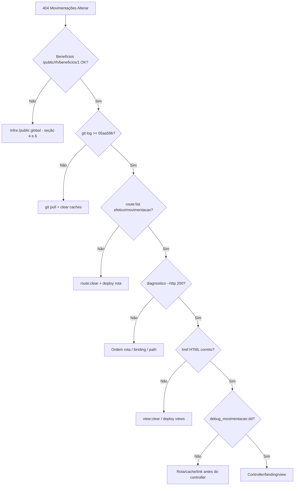

# Causa raiz — 404 em produção (Hostinger + `/public` na URL)

**Projeto:** omegaadm / omega286  
**Domínio:** `https://omegaadm.feston.net.br`  
**Sintoma:** `404 | NOT FOUND` em rotas dinâmicas RH (Benefícios, Movimentações / Alterar, etc.)  
**Localhost:** funciona (`http://127.0.0.1:2080/rh/...` sem `/public` no path)  
**Data:** maio/2026  

---

## 1. Conclusão executiva (atualizada)

### Benefícios = referência funcional em produção

Se **Benefícios** abre e **Salvar/Excluir/Vincular** funcionam em:

```text
https://omegaadm.feston.net.br/public/rh/beneficios/1
```

então **não dá para afirmar que o ambiente inteiro está quebrado**. O rewrite, a base `/public` e o padrão GET+POST em rota dinâmica **já foram validados** em pelo menos uma tela.

### Movimentações = investigar diferenças (não “consertar o universo de novo”)

O 404 em **Alterar** em `/public/rh/efetivo/movimentacao/{id}` é **parecido** com o que benefícios tinha, mas a cobrança correta agora é:

> **Benefícios já funciona. Compare Movimentações com Benefícios e encontre o que ainda está diferente** em rota, ordem de rota, cache, link no HTML, singular/plural ou model binding.

| Hipótese para Movimentações | Por que é plausível |
|---------------------------|---------------------|
| Rota ausente ou **route cache** antigo | Benefícios no commit novo; movimentações não deployada |
| Ordem de rota (`efetivo/{colaborador}` antes de `efetivo/movimentacao/{id}`) | Laravel pode confundir segmentos |
| **Link antigo** no HTML (cache de view) | `href` ainda aponta para URL legada |
| **Singular vs plural** (`movimentacao` vs `movimentacoes`) | Gestão = singular; listagem = plural |
| Model binding / registro inexistente | 404 após rota casar |
| Deploy incompleto (`< 05aa59b`) | Código certo só no Git |

### Melhoria de infra (opcional, não bloqueante para fechar Movimentações)

Apontar document root para `omegaadm/public` e `APP_URL` sem `/public` continua sendo a **solução mais limpa** a longo prazo ([HOSTINGER_DOCUMENT_ROOT.md](./HOSTINGER_DOCUMENT_ROOT.md)). Não substitui o checklist de comparação com Benefícios enquanto Movimentações estiver 404.

Documentos:

- [DEV_BENEFICIOS_404_PRODUCAO.md](./DEV_BENEFICIOS_404_PRODUCAO.md) — referência que funciona
- [DEV_MOVIMENTACOES_404_PRODUCAO.md](./DEV_MOVIMENTACOES_404_PRODUCAO.md) — caso aberto
- [HOSTINGER_DOCUMENT_ROOT.md](./HOSTINGER_DOCUMENT_ROOT.md)

---

## 2. Casos confirmados

### Benefícios (referência — OK em produção)

- URL: `/public/rh/beneficios/{id}`
- `Route::match(['get','post'], 'beneficios/{beneficio}', show)` — mesma URL para GET e POST
- Infra: `fix-public-request-uri`, `ForceRequestRootUrl`, forms com `route('rh.beneficios.show', $beneficio)`

**Use este módulo como espelho** ao depurar Movimentações.

### Movimentações (caso aberto)

| Ambiente | URL botão **Alterar** | Resultado |
|----------|------------------------|-----------|
| **Produção** | `https://omegaadm.feston.net.br/public/rh/efetivo/movimentacao/2` | **404** |
| **Localhost** | `http://127.0.0.1:2080/rh/efetivo/movimentacao/2` | **200** + formulário |

- Listagem `/public/rh/efetivo/movimentacoes` reportada **OK** (layout e CSS corrigidos em `436330f`).
- Registro `mov_id=2` existe no banco (ex.: afastamento INSS, colaborador 34).
- Erros `pinComponent.js` / `chrome-extension` no console → **ignorar** (extensão do navegador).

---

## 3. O que o repositório já implementou (não repetir módulo a módulo)

Commits relevantes em `main` (ordem aproximada):

| Commit | Escopo |
|--------|--------|
| `930071f` / `3bb5a2d` | Normalização `REQUEST_URI` `/public` (benefícios) |
| `8224cda` | Movimentações: GET+POST mesma URL (padrão benefícios) |
| `e6b360b` | Path `rh/efetivo/movimentacao/{id}` |
| `2533484` / `436330f` | CSS/JS: `ForceRequestRootUrl` + `Vite` + `PublicWebBase` |
| `05aa59b` | Rotas movimentação no topo do grupo `rh` |
| `54500a1` | Documentação handoff movimentações |

**Código compartilhado (todos os módulos RH):**

- `bootstrap/fix-public-request-uri.php` — strip `/public` no path do router
- `index.php` (raiz) + `public/index.php` — carregam o fix
- `.htaccess` (raiz) — rewrite `/public/*` → `public/index.php`
- `app/Http/Middleware/ForceRequestRootUrl.php`
- `app/Support/PublicWebBase.php`
- `config/app.php` → `force_public_url` default `true` em `APP_ENV=production`

Se Benefícios funciona no mesmo servidor e Movimentações retorna 404 com commit `>= 05aa59b`, o gargalo é **específico de Movimentações** (deploy dessa rota, cache, ordem, link, binding) — não “rewrite global quebrado”.

---

## 4. Solução definitiva (infra — prioridade máxima)

### Passos no hPanel Hostinger

1. **Websites** → site → **Document Root**
2. Alterar de `.../omegaadm` para `.../omegaadm/public`
3. No `.env` do servidor:

```env
APP_URL=https://omegaadm.feston.net.br
APP_FORCE_PUBLIC_URL=false
```

4. SSH:

```bash
cd ~/domains/feston.net.br/public_html/omegaadm
php artisan config:clear
php artisan route:clear
php artisan view:clear
php artisan optimize:clear
php artisan storage:link
```

### URLs esperadas após a mudança (iguais ao localhost)

```text
https://omegaadm.feston.net.br/rh/beneficios/1
https://omegaadm.feston.net.br/rh/efetivo/movimentacoes
https://omegaadm.feston.net.br/rh/efetivo/movimentacao/2
```

**Sem** `/public` na barra de endereço.

### Critérios de aceite (entrega final)

- [ ] Causa raiz confirmada (documentada neste arquivo ou comentário no ticket)
- [ ] Print ou texto de `php artisan route:list --path=efetivo/movimentacao`
- [ ] Retorno de `movimentacoes:diagnostico 2 --mov --http` com status **200**
- [ ] Teste real no navegador: Benefícios abrir + Salvar
- [ ] Teste real no navegador: Movimentações → Alterar → Salvar
- [ ] Nenhuma tela RH com 404 em ação editar/salvar/excluir (amostragem combinada)

---

## 5. Enquanto o document root não mudar (workaround)

Garantir no servidor:

1. Arquivos `bootstrap/fix-public-request-uri.php`, `.htaccess` raiz, `index.php` raiz **idênticos** ao `main` do Git
2. **Nunca** deixar `bootstrap/cache/routes-v7.php` desatualizado após deploy
3. `APP_FORCE_PUBLIC_URL=true` se links/CSS ainda saírem sem `/public`
4. Não usar `php artisan route:cache` em produção até o ambiente estar estável (ou sempre `route:clear` após deploy)

---

## 6. Checklist obrigatório em produção (copiar para o ticket)

Executar **no servidor**, na pasta do projeto (`omegaadm`):

```bash
cd ~/domains/feston.net.br/public_html/omegaadm
```

### 6.1 Commit atual

```bash
git fetch origin main
git pull origin main
git log -1 --oneline
```

**Esperado:** `05aa59b` ou mais recente (ex.: `54500a1` docs).

### 6.2 Limpar cache real

```bash
php artisan config:clear
php artisan route:clear
php artisan view:clear
php artisan optimize:clear
rm -f bootstrap/cache/routes*.php
```

### 6.3 Rota de movimentação existe?

```bash
php artisan route:list --path=efetivo/movimentacao
```

**Esperado:**

```text
GET|POST|HEAD  rh/efetivo/movimentacao/{movimentacao}  rh.efetivo.movimentacoes.edit
```

Se não aparecer → código antigo ou route cache.

### 6.4 Diagnóstico movimentações

```bash
php artisan movimentacoes:diagnostico --rota
php artisan movimentacoes:diagnostico --listar
php artisan movimentacoes:diagnostico 2 --mov
php artisan movimentacoes:diagnostico 2 --mov --http
```

| Comando | Esperado |
|---------|----------|
| `--rota` | `rh.efetivo.movimentacoes.edit: SIM` |
| `--listar` | tabela com `mov_id` reais |
| `2 --mov` | OK + URL `/public/rh/efetivo/movimentacao/2` |
| `2 --mov --http` | **status 200** |

### 6.5 Teste curl (sem sessão)

```bash
curl -sI "https://omegaadm.feston.net.br/public/rh/efetivo/movimentacao/2" | head -5
curl -sI "https://omegaadm.feston.net.br/public/rh/beneficios/1" | head -5
```

Interpretação:

| HTTP | Significado |
|------|-------------|
| **404** | Rota/rewrite não casa ou binding 404 |
| **302** / **301** | Rota existe; testar logado |
| **419** | POST sem CSRF (rota existe) |

Comparar: se benefícios retorna 302 e movimentação 404 → problema específico de rota deploy/cache; se **ambos 404** → rewrite/path global.

### 6.6 Debug no navegador (temporário)

Com `APP_DEBUG=true` (reverter depois):

```text
https://omegaadm.feston.net.br/public/rh/efetivo/movimentacao/2?debug_movimentacao=1
```

| Resultado | Conclusão |
|-----------|-----------|
| **`dd()` não aparece** | Requisição **não chega** em `ColaboradorMovimentacaoController@editar` → rota, rewrite, cache ou deploy |
| **`dd()` aparece** | Ver `path`, `request_uri`, `expected_route`; se `path` = `public/rh/...` → fix-public não aplicado |

Campos esperados no `dd()`:

| Campo | Valor esperado |
|-------|----------------|
| `path` | `rh/efetivo/movimentacao/2` |
| `expected_route` | `rh/efetivo/movimentacao/2` |

### 6.7 HTML da listagem (Inspecionar → Alterar)

Confirmar `href`:

```text
✅ .../public/rh/efetivo/movimentacao/2
```

**Não** deve ser URL antiga:

```text
❌ .../rh/movimentacoes/2/editar
❌ .../rh/efetivo/movimentacoes/2/editar
❌ .../rh/efetivo/35/movimentacoes/2/editar
```

Se o `href` estiver correto e o clique ainda 404 → servidor/rota; se `href` antigo → `view:clear` ou deploy incompleto.

### 6.8 Fix `/public` carregado?

```bash
test -f bootstrap/fix-public-request-uri.php && echo "fix OK"
grep -n "OMEGA_REQUEST_USES_PUBLIC_URL" bootstrap/fix-public-request-uri.php
head -5 index.php
head -25 public/index.php
```

`index.php` raiz deve incluir `fix-public-request-uri` antes de `public/index.php`.  
`public/index.php` deve incluir o mesmo `require` do fix.

### 6.9 Dados do servidor (responder no ticket)

1. Apache, LiteSpeed ou Nginx?
2. Document root atual: `omegaadm` ou `omegaadm/public`?
3. Existe `bootstrap/cache/routes-v7.php` após `route:clear`?
4. Saída completa dos comandos 6.3, 6.4 e 6.5

---

## 7. Benefícios vs Movimentações (o que comparar)

| Item | Benefícios (OK) | Movimentações (404) |
|------|-----------------|---------------------|
| Path router | `rh/beneficios/{beneficio}` | `rh/efetivo/movimentacao/{movimentacao}` |
| Métodos | GET + POST (match) | GET + POST (match) |
| Controller | `BeneficioController@show` | `ColaboradorMovimentacaoController@editar` |
| Form action | `route('rh.beneficios.show', $beneficio)` | `route('rh.efetivo.movimentacoes.edit', $mov)` |
| Armadilha de nome | `beneficios/create` excluído do show | **singular** `movimentacao` vs **plural** `movimentacoes` (listagem) |
| Ordem no `web.php` | match antes de resource | match no **topo** do grupo `rh` (commit `05aa59b`) |
| Legado | redirects para `beneficios.show` | redirects 301 para `efetivo.movimentacao/{id}` |

Se Benefícios passa e Movimentações não, com mesmo `git log` e mesmo `route:clear`, foco em: **route:list**, **href do botão**, **diagnostico --http**, **debug_movimentacao=1**.

---

## 8. Árvore de decisão (dev)



---

## 9. Mensagem pronta para o desenvolvedor (copiar/colar)

**Cobrança em uma frase:** não reabra o problema como ambiente global; use Benefícios como referência e feche a diferença específica de Movimentações (abrir, alterar e salvar sem 404).

```text
Entendi. Como Benefícios já está funcionando em produção, então ele passa a ser nossa referência funcional.

Ou seja: não quero que Movimentações seja tratado como se o ambiente inteiro estivesse quebrado novamente. Benefícios prova que o sistema consegue operar com /public em rota dinâmica GET/POST.

Agora preciso que você compare Movimentações com Benefícios e encontre exatamente o que está diferente.

Validar obrigatoriamente:

1. Commit atual em produção:
git log -1 --oneline

Precisa estar em 05aa59b ou mais recente.

2. Limpar cache real:
php artisan config:clear
php artisan route:clear
php artisan view:clear
php artisan optimize:clear
rm -f bootstrap/cache/routes*.php

3. Confirmar rota:
php artisan route:list --path=efetivo/movimentacao

Precisa aparecer:
GET|POST|HEAD rh/efetivo/movimentacao/{movimentacao}

4. Confirmar se a rota está antes de rotas genéricas como:
rh/efetivo/{colaborador}

Se a rota genérica vier antes, o Laravel pode interpretar "movimentacao" como parâmetro e retornar 404.

5. Rodar diagnóstico:
php artisan movimentacoes:diagnostico --rota
php artisan movimentacoes:diagnostico --listar
php artisan movimentacoes:diagnostico 2 --mov
php artisan movimentacoes:diagnostico 2 --mov --http

O --http precisa retornar 200.

6. Conferir no HTML da listagem se o botão Alterar está gerando o href correto:

Correto:
.../public/rh/efetivo/movimentacao/2

Errado:
.../public/rh/movimentacoes/2/editar
.../public/rh/efetivo/movimentacoes/2/editar
.../public/rh/efetivo/34/movimentacoes/2/editar

7. Testar debug:
https://omegaadm.feston.net.br/public/rh/efetivo/movimentacao/2?debug_movimentacao=1

Se o debug não aparecer, o problema está antes do controller: rota, cache, deploy, ordem de rota ou link antigo.
Se o debug aparecer, o problema está dentro do controller, binding ou view.

Atenção ao singular/plural:
- Listagem: rh/efetivo/movimentacoes
- Alterar/Salvar: rh/efetivo/movimentacao/{id}

Documentação:
docs/DEV_PRODUCAO_CAUSA_RAIZ_HOSTINGER.md (esta seção)
docs/DEV_MOVIMENTACOES_404_PRODUCAO.md
docs/DEV_BENEFICIOS_404_PRODUCAO.md (referência que funciona)

Conclusão: Benefícios funcionando é o espelho. Movimentações precisa seguir o mesmo padrão e funcionar também em produção, com abrir, alterar e salvar sem 404.
```

---

## 10. Referência rápida — arquivos de infra

| Arquivo | Papel |
|---------|--------|
| `.htaccess` | Rewrite `/public/*` → `public/index.php` |
| `index.php` | Entrada raiz + fix URI |
| `public/index.php` | Front controller + fix URI |
| `bootstrap/fix-public-request-uri.php` | `OMEGA_REQUEST_USES_PUBLIC_URL`, strip `/public` do path |
| `app/Http/Middleware/ForceRequestRootUrl.php` | Base URL e Vite com `/public` |
| `config/app.php` | `force_public_url` |

---

*Atualizar este documento quando o document root for migrado ou quando o checklist 6 for executado com resultados.*
