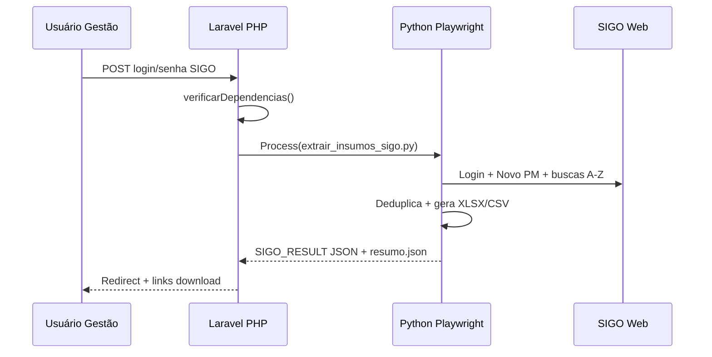

# Integração SIGO — Extração de catálogo de insumos

> **Status (2026-05-24): NÃO PRONTO PARA PRODUÇÃO** — protótipo funcional parcial.  
> Bloqueios: **WinError 10106** (PHP web → Python) e **seletores SIGO não validados**.  
> Ver **seção AUDITORIA FINAL** e **ORDEM PARA O DEV** no final deste documento.

Documento para o desenvolvedor responsável por revisar, corrigir e colocar em produção a funcionalidade **“Extrair insumos SIGO”** no módulo Almoxarifado do Omega286.

**Última atualização:** 2026-05-24  
**Branch:** `main`  
**Commits principais:** `341048c`, `f9009a8`, `929e2ac`, `05e3de2`

---

## 1. Objetivo de negócio

O SIGO (sistema legado Omega) possui o cadastro completo de insumos/produtos na tela **Novo Pedido**:

```text
http://sigo.omegaservice.com.br/SIGO/PM/NovoPM
```

Essa tela **não lista todos os produtos de uma vez**. Ela funciona como **busca paginada** (ex.: filtrar `LAMPA`, paginação `1 2 3 4`, mensagem “20 Resultados ou mais...”).

O mesmo `COD` pode aparecer várias vezes com `DETALHE` diferente. A deduplicação correta é:

```text
COD + INSUMO + DETALHE + UND + GRUPO + FAMILIA
```

**Não** deduplicar só por `COD`.

A funcionalidade implementada permite que um usuário **Gestão** do almoxarifado informe login/senha do SIGO na interface web; o sistema executa um robô (Playwright/Python), extrai o catálogo e disponibiliza download em **XLSX** e **CSV**.

---

## 2. O que foi implementado (visão geral)

| Camada | Arquivo / rota | Função |
|--------|----------------|--------|
| Rota | `GET /almoxarifado/sigo-insumos` | Formulário + status do ambiente |
| Rota | `POST /almoxarifado/sigo-insumos/extrair` | Dispara extração (síncrona) |
| Rota | `GET /almoxarifado/sigo-insumos/download/{token}/{tipo}` | Download xlsx/csv/log |
| Controller | `app/Http/Controllers/Almoxarifado/SigoInsumosController.php` | HTTP |
| Service | `app/Support/Almoxarifado/SigoInsumosExtracaoService.php` | Orquestra Python via Symfony Process |
| Config | `config/sigo.php` | URLs SIGO, Python, timeout |
| View | `resources/views/almoxarifado/sigo-insumos/index.blade.php` | UI |
| Menu | `resources/views/layouts/app.blade.php` | Link “Extrair insumos SIGO” |
| Permissão | `AlmoxarifadoAcesso::podeExtrairInsumosSigo()` | Apenas papel **Gestão** |
| Script principal | `scripts/extrair_insumos_sigo.py` | Robô Playwright |
| Script verificação | `scripts/sigo_check_deps.py` | Teste import Playwright/openpyxl |
| Dependências | `scripts/requirements-sigo-extractor.txt` | playwright, openpyxl |
| Testes | `tests/Feature/Almoxarifado/SigoInsumosExtracaoTest.php` | 4 testes (mock do service) |
| Local dev | `abrir-local-2080.bat` | Usa `C:\xampp\php\php.exe` + `config:clear` |

---

## 3. Fluxo técnico



### Armazenamento dos arquivos gerados

```text
storage/app/almoxarifado/sigo-extracoes/{token}/
  insumos_sigo_extraidos.xlsx
  insumos_sigo_extraidos.csv
  extracao_sigo_resumo.json
  extracao_sigo_YYYYMMDD_HHMMSS.log
```

- `{token}` = timestamp + random (ex.: `20260524_195451_a1b2c3d4`)
- A senha SIGO **não é persistida** — só vai para variáveis de ambiente do subprocesso durante a execução.

### Colunas da planilha final

| Coluna | Origem |
|--------|--------|
| COD | Tabela de resultados da busca |
| INSUMO | idem |
| DETALHE | idem |
| UND | idem |
| GRUPO | idem |
| FAMILIA | idem |
| CHAVE_UNICA | Concatenação normalizada dos campos acima |
| DATA_EXTRACAO | Timestamp da extração |

---

## 4. Configuração (.env)

```env
# Caminho completo do python.exe (obrigatório no Windows — usar barras / ou aspas)
SIGO_PYTHON=C:/Users/Administrator/AppData/Local/Programs/Python/Python313/python.exe

# URLs do SIGO (ajustar se ambiente diferente)
SIGO_BASE_URL=http://sigo.omegaservice.com.br
SIGO_LOGIN_PATH=/SIGO/Login
SIGO_PM_PATH=/SIGO/PM/NovoPM

# Timeout da extração em segundos (varredura completa pode levar muito tempo)
SIGO_EXTRACAO_TIMEOUT=3600

# 0 = browser visível (debug); 1 = headless (padrão)
SIGO_HEADLESS=1
```

**Importante no Windows:** evitar backslash solto no `.env` (`C:\Users\...`) — o parser do Laravel pode interpretar `\U`, `\P` etc. Preferir:

```env
SIGO_PYTHON=C:/Users/Administrator/AppData/Local/Programs/Python/Python313/python.exe
```

---

## 5. Pré-requisitos no servidor que roda o Laravel

A extração **não roda só com PHP**. É necessário:

1. **Python 3** (testado com 3.13)
2. Pacotes Python:

   ```powershell
   cd C:\caminho\do\projeto\omega286
   C:\...\Python313\python.exe -m pip install -r scripts/requirements-sigo-extractor.txt
   C:\...\Python313\python.exe -m playwright install chromium
   ```

3. **Rede** até `sigo.omegaservice.com.br` (VPN/rede interna se aplicável)
4. **Hostinger / shared hosting:** em geral **não suporta** Playwright/Chromium. A extração deve rodar em:
   - Máquina Windows/Linux da empresa com acesso ao SIGO, **ou**
   - Worker/VM dedicada, **ou**
   - Exportação direta do banco do SIGO (melhor opção — ver seção 10)

### Verificação manual (CLI)

```powershell
C:\...\Python313\python.exe scripts\sigo_check_deps.py
# Deve imprimir: ok
```

### Verificação via Laravel (CLI)

```powershell
C:\xampp\php\php.exe artisan config:clear
C:\xampp\php\php.exe tmp\test_sigo_status.php
# Deve retornar JSON sem campo "diagnostico"
```

---

## 6. Lógica do robô Python (`scripts/extrair_insumos_sigo.py`)

1. Login em `{SIGO_BASE_URL}{SIGO_LOGIN_PATH}`
2. Navega para `{SIGO_BASE_URL}{SIGO_PM_PATH}` (Novo PM)
3. Tenta **busca vazia** e percorre **todas as páginas** da paginação
4. Se aparecer “Resultados ou mais” ou busca vazia insuficiente → varredura **A–Z** e **0–9**
5. Em cada página, lê a **tabela superior** de resultados (ignora “Relação de itens a serem solicitados”)
6. Deduplica pela chave composta
7. Exporta XLSX/CSV e grava `extracao_sigo_resumo.json`
8. Imprime na stdout: `SIGO_RESULT:{...json...}` (Laravel parseia isso)

### Seletores CSS (precisam validação no F12)

Definidos no topo do script — **provavelmente incorretos** até alguém inspecionar o HTML real do SIGO:

```python
SELECTORS = {
    "login_user": 'input[name*="Usuario"], ...',
    "login_pass": 'input[name*="Senha"], ...',
    "search_input": 'input[placeholder*="Descrição"], ...',
    ...
}
```

**Tarefa do dev:** abrir SIGO autenticado → F12 → Network → pesquisar `LAMPA` → copiar requisição real (URL, POST body, ViewState se ASP.NET) e ajustar seletores ou trocar robô por chamada HTTP direta.

---

## 7. Problemas encontrados em localhost (histórico)

### 7.1 Comandos no diretório errado

Usuário rodou `pip install` em `C:\WINDOWS\system32`. O correto é sempre:

```powershell
cd C:\Users\Administrator\Documents\omega286
```

### 7.2 PHP não encontrava o Python certo

No Windows existem dois `python.exe`:

- `...\Python313\python.exe` (correto, com Playwright)
- `...\WindowsApps\python.exe` (stub Microsoft Store — falha)

**Correção aplicada:** `SIGO_PYTHON` no `.env` + auto-detecção em `config/sigo.php` + `SigoInsumosExtracaoService::resolverPython()`.

### 7.3 Verificação passava no terminal mas falhava na tela web

Causas prováveis:

- Servidor Laravel **não reiniciado** após alterar `.env`
- **Dois processos** `artisan serve` na porta 2080 (conflito)
- `abrir-local-2080.bat` usava `php` genérico em vez de `C:\xampp\php\php.exe`

**Correção aplicada:** bat atualizado; orientação para `config:clear` + restart.

### 7.4 Playwright corrompido / import falhando

Erro:

```text
from playwright.sync_api import Page, sync_playwright
ModuleNotFoundError / erro em playwright.sync_api._generated
```

**Correção:** `pip install --force-reinstall playwright openpyxl` + `playwright install chromium`.

### 7.5 Erro atual reportado na UI — WinError 10106

Mensagem na tela (2026-05-24):

```text
SIGO_PYTHON configurado, mas a verificação falhou em
C:/Users/Administrator/AppData/Local/Programs/Python/Python313/python.exe:
[WinError 10106] O provedor de serviços solicitado não pôde ser carregado ou inicializado.
```

**O que significa:** erro de **Winsock / provedor de serviços de rede do Windows** ao subir processo Python **a partir do PHP** (`proc_open` / Symfony Process). Código Windows `10106` = `WSASYSNOTREADY` — stack de sockets não inicializada corretamente no contexto do subprocesso.

**Observação crítica:** o mesmo Python funciona quando:

- Executado **diretamente no PowerShell** (`python scripts/sigo_check_deps.py` → `ok`)
- Executado via **`C:\xampp\php\php.exe tmp/test_sigo_status.php`** em alguns momentos

Mas **falha** quando o processo é spawnado pelo **PHP do servidor web** (`artisan serve` / IIS / Apache) — possivelmente por:

1. Ambiente (`PATH`, `SYSTEMROOT`, `WINDIR`) incompleto no subprocesso
2. PHP em modo diferente (TS vs NTS, Apache module vs CLI)
3. Restrição de sandbox/permissão ao criar filhos com DLLs de rede (greenlet/asyncio/playwright)
4. Antivírus bloqueando Chromium/network stack no filho do PHP

**Isso precisa ser investigado e corrigido pelo dev** (ver seção 8).

### 7.6 Extração chegou a login mas deu timeout no campo de busca

Em teste automatizado, após login aparentemente OK:

```text
Locator.wait_for: Timeout 60000ms exceeded.
waiting for locator("input[placeholder*=\"Descrição\"]...").first to be visible
```

Indica que **login/seletores/URL** ainda não estão corretos para o HTML real do SIGO — independente do WinError 10106.

---

## 8. O que o dev precisa corrigir (prioridade)

### P0 — WinError 10106 (PHP → Python)

- [ ] Reproduzir: abrir `/almoxarifado/sigo-insumos` logado como Gestão e capturar stderr completo de `sigo_check_deps.py` quando chamado pelo service
- [ ] Comparar ambiente:
  - `php artisan tinker` → `Process` com mesmo comando da verificação
  - `php-fpm`/Apache vs `php artisan serve` vs `C:\xampp\php\php.exe`
- [ ] Garantir que `Process::mustRun($callback, $env)` **mescle** variáveis críticas do Windows:
  - `PATH`, `SYSTEMROOT`, `WINDIR`, `TEMP`, `TMP`, `USERPROFILE`, `LOCALAPPDATA`, `APPDATA`
  - Hoje o service passa `$env` customizado via segundo argumento de `mustRun()`; validar se `getDefaultEnv()` do Symfony está completo nesse contexto
- [ ] Alternativa robusta: **não spawnar Python de dentro do PHP** — usar:
  - **Queue + worker** dedicado (Supervisor) rodando script Python
  - **Comando Artisan** `php artisan sigo:extrair-insumos` executado manualmente ou via scheduler
  - **API interna** em serviço Node/Python separado
- [ ] Testar execução com `proc_open` disabled_functions no `php.ini`

### P1 — Seletores e login SIGO

- [ ] Validar URL de login real (`/SIGO/Login` pode estar errada)
- [ ] Inspecionar F12 na tela Novo PM — ajustar `SELECTORS` em `extrair_insumos_sigo.py`
- [ ] Preferir **capturar requisição HTTP** da busca (POST ASP.NET) em vez de clicar na UI
- [ ] Salvar screenshot HTML em falha (`page.screenshot`) para debug

### P2 — UX / produção

- [ ] Extração síncrona trava a aba por muitos minutos → migrar para **Job + polling** ou notificação
- [ ] Documentar que **Hostinger não roda Playwright** — definir arquitetura (VM local, VPN, export SQL)
- [ ] Remover arquivos temporários `tmp/test_sigo_*.php` do repo ou ignorar no `.gitignore`
- [ ] Considerar `php artisan sigo:diagnostico` oficial

### P3 — Segurança

- [ ] Credenciais SIGO trafegam em POST HTTPS — OK em produção com TLS
- [ ] Logs não devem gravar senha (hoje não gravamos — manter assim)
- [ ] Tokens de download previsíveis? Usar UUID + expiração opcional

---

## 9. Como testar (checklist dev)

```powershell
# 1. Dependências Python
cd C:\Users\Administrator\Documents\omega286
C:\Users\Administrator\AppData\Local\Programs\Python\Python313\python.exe scripts\sigo_check_deps.py

# 2. Laravel
C:\xampp\php\php.exe artisan config:clear
C:\xampp\php\php.exe artisan test --filter=SigoInsumosExtracaoTest

# 3. Servidor (matar duplicados na 2080 antes)
C:\xampp\php\php.exe artisan serve --host=127.0.0.1 --port=2080

# 4. Browser — usuário com perfil Gestão almoxarifado
# http://127.0.0.1:2080/almoxarifado/sigo-insumos
# Deve mostrar faixa verde "Ambiente pronto"
```

### Teste manual do script (sem Laravel)

```powershell
$env:SIGO_USER = "usuario_sigo"
$env:SIGO_PASS = "senha_sigo"
C:\...\Python313\python.exe scripts\extrair_insumos_sigo.py `
  --usuario $env:SIGO_USER --senha $env:SIGO_PASS `
  --output-dir tmp\sigo-teste `
  --headless 0
```

(`--headless 0` abre o browser visível — útil para debug.)

---

## 10. Alternativa recomendada (100% dos dados)

Se alguém tiver acesso ao **banco do SIGO**, pedir exportação SQL/CSV da tabela de insumos:

```text
COD | INSUMO | DETALHE | UND | GRUPO | FAMILIA
```

Isso elimina robô, Playwright, WinError 10106 e paginação. O robô web é **plan B**.

---

## 11. Commits Git relacionados

| Commit | Descrição |
|--------|-----------|
| `341048c` | Feature inicial: tela, service, script Python, rotas, testes |
| `f9009a8` | Detecção automática Python no Windows |
| `929e2ac` | Correção execução Process + mensagens de erro amigáveis |
| `05e3de2` | Script `sigo_check_deps.py` + bat local com XAMPP PHP |

---

## 12. Arquivos para o dev revisar primeiro

1. `app/Support/Almoxarifado/SigoInsumosExtracaoService.php` — ponto central; WinError 10106 nasce aqui
2. `scripts/extrair_insumos_sigo.py` — seletores e lógica SIGO
3. `scripts/sigo_check_deps.py` — verificação de deps
4. `config/sigo.php` + `.env` (`SIGO_PYTHON`)
5. `resources/views/almoxarifado/sigo-insumos/index.blade.php` — UI e mensagens
6. `tests/Feature/Almoxarifado/SigoInsumosExtracaoTest.php` — **mocka** o service; não testa Python real

---

## 13. Perguntas para o dev responder

1. Por que `sigo_check_deps.py` funciona no PowerShell mas falha com **WinError 10106** quando o PHP da web spawna o processo?
2. Qual PHP roda em produção (Hostinger)? Playwright é viável lá?
3. Qual a URL/campos corretos de login e busca no SIGO (F12)?
4. Vale migrar extração para **queue/worker** ou **export SQL** do SIGO?
5. Os seletores atuais batem com o HTML ASP.NET postback do Novo PM?

---

**Próximo passo:** ver **AUDITORIA FINAL** e **ORDEM PARA O DEV** abaixo — não considerar entregue até cumprir checklist de aceite.

---

## AUDITORIA FINAL

A funcionalidade **não está pronta para produção**. Ela está em estado de **protótipo funcional parcial**: tem tela, rotas, permissões, service, script Python e testes mockados, mas os dois pontos centrais ainda não estão resolvidos:

1. **Execução confiável do Python via PHP web** (WinError 10106)
2. **Extração real validada dentro do SIGO** (seletores não confirmados no HTML)

O Python/Playwright funciona no terminal, mas falha quando chamado pelo PHP web. Os seletores do SIGO ainda não foram validados no F12.

**Ordem para o dev:** parar de considerar isso como concluído → corrigir arquitetura de execução → validar extração real no SIGO.

---

## ORDEM PARA O DEV

Dev, audite e corrija a funcionalidade **“Extrair insumos SIGO”** do módulo Almoxarifado. A entrega atual **não pode ser considerada finalizada**.

### 1. Corrigir primeiro o erro P0 — PHP web chamando Python

Erro principal:

```text
[WinError 10106] O provedor de serviços solicitado não pôde ser carregado ou inicializado.
```

Acontece quando o Laravel/PHP executa Python/Playwright via `Symfony Process`, mas o mesmo Python funciona no PowerShell. **Não é falta simples de Playwright** — é o ambiente do subprocesso spawnado pelo PHP web.

**Ordens obrigatórias:**

1. Revisar imediatamente: `app/Support/Almoxarifado/SigoInsumosExtracaoService.php`
2. Garantir que o `Process` não perca variáveis críticas do Windows:

   ```text
   PATH, SYSTEMROOT, WINDIR, TEMP, TMP, USERPROFILE, LOCALAPPDATA, APPDATA
   ```

3. Comparar execução em três cenários:

   ```powershell
   C:\xampp\php\php.exe artisan tinker
   C:\xampp\php\php.exe artisan serve --host=127.0.0.1 --port=2080
   Apache/IIS/XAMPP web (se aplicável)
   ```

4. Criar log técnico real com:

   ```text
   PHP_BINARY, PHP_SAPI, getcwd(), PATH, SYSTEMROOT, WINDIR, TEMP, TMP,
   USERPROFILE, LOCALAPPDATA, APPDATA, SIGO_PYTHON,
   comando executado, stdout, stderr, exitCode
   ```

5. Tela pode mostrar erro amigável; **log deve guardar erro completo** (não mascarar).

---

### 2. Não deixar extração pesada presa na requisição HTTP

Hoje: `POST /almoxarifado/sigo-insumos/extrair` (síncrono). Varredura completa pode levar minutos → trava navegador, timeout PHP, perda de processo.

**Migrar para uma destas arquiteturas:**

| Opção | Descrição |
|-------|-----------|
| **Preferencial** | Laravel Job + fila + status por polling |
| **Alternativa** | `php artisan sigo:extrair-insumos` |
| **Mais robusta** | Serviço Python/Node separado; Laravel só consulta status |

Fluxo preferencial:

```text
Usuário clica "Iniciar extração"
→ Registro no banco (status: aguardando)
→ Job em background
→ Tela: aguardando / executando / concluído / erro
→ Download XLSX/CSV ao concluir
```

**Não aceitar** como solução final: PHP web + Playwright em POST longo.

---

### 3. Validar o SIGO de verdade pelo F12

Seletores atuais são prováveis, não confirmados.

**Ordem:**

```text
F12 > Network → pesquisar LAMPA
→ URL, método, payload, cookies, ViewState (ASP.NET), paginação
```

Depois decidir:

| Caminho | Quando usar |
|---------|-------------|
| **A — HTTP direto** | Melhor se requisição for reutilizável |
| **B — Playwright** | Aceitável com seletores reais |
| **C — Export SQL/CSV** | **Melhor de todos** se houver acesso ao banco SIGO |

Campos da exportação:

```text
COD | INSUMO | DETALHE | UND | GRUPO | FAMILIA
```

---

### 4. Corrigir lógica de extração (não perder produtos)

- Busca paginada; mesmo `COD` com detalhes diferentes
- **Proibido** deduplicar só por `COD`
- Chave obrigatória: `COD + INSUMO + DETALHE + UND + GRUPO + FAMILIA`

Garantir:

1. Busca vazia (se SIGO permitir)
2. Todas as páginas de cada busca
3. Se “20 resultados ou mais” → varredura A–Z e 0–9
4. Relatório final: brutos, únicos, por termo, por página, erros, tempo total

---

### 5. Testes atuais não provam extração real

`SigoInsumosExtracaoTest` **mocka** o service — valida rota/permissão, não Python nem SIGO.

**Adicionar comandos Artisan:**

```text
php artisan sigo:diagnostico
php artisan sigo:testar-python
php artisan sigo:testar-login --headless=0
php artisan sigo:testar-busca --termo=LAMPA --headless=0
```

Cada um retorna: OK/ERRO, python usado, versão, Playwright/Chromium, URL, screenshot/HTML em falha.

---

### 6. Produção — decidir arquitetura antes de continuar

Hostinger/shared hosting **não suporta** Playwright/Chromium em geral.

Responder:

```text
Onde roda? Produção atual? Máquina local? VM? Worker? VPN para SIGO?
```

Se for hospedagem compartilhada: **worker externo ou export SQL** — não Playwright na hospedagem.

---

### 7. Segurança dos downloads

Endurecer token (`Str::uuid()` ou `Str::random(40)`).

Tabela sugerida `sigo_extracoes`:

```text
id, uuid, usuario_id, status, total_extraido,
caminho_xlsx, caminho_csv, caminho_log, erro,
iniciado_em, finalizado_em
```

Download só para Gestão.

---

### 8. Log e evidência de erro

Em falha Playwright, salvar:

```text
storage/app/almoxarifado/sigo-extracoes/{uuid}/debug/
  erro.txt, screenshot.png, pagina.html, stdout.log, stderr.log
```

---

## CHECKLIST DE ACEITE

Só considerar entregue quando **todos** estiverem OK:

```text
[ ] Tela /almoxarifado/sigo-insumos sem WinError 10106
[ ] Python executa no mesmo contexto da aplicação web
[ ] Comando artisan sigo:diagnostico
[ ] Log completo stdout/stderr/exitCode
[ ] Login SIGO validado (browser visível)
[ ] Campo de busca validado no HTML real
[ ] Paginação validada
[ ] Busca LAMPA retorna produtos reais
[ ] Extração gera XLSX e CSV
[ ] Deduplicação: COD + INSUMO + DETALHE + UND + GRUPO + FAMILIA
[ ] Teste não depende só de mock
[ ] Produção definida (worker / VM / SQL)
[ ] Credenciais não gravadas em log
[ ] Download protegido por permissão
```

---

## MENSAGEM CURTA PARA ENVIAR AO DEV

> Dev, auditei a implementação da extração de insumos SIGO. A funcionalidade ainda **não está pronta para produção**. O bloqueio principal é o **WinError 10106** quando o PHP web tenta executar o Python/Playwright. Não aceite isso como problema de usuário ou instalação simples, porque o Python funciona no PowerShell. Precisa revisar o `SigoInsumosExtracaoService.php`, comparar PHP CLI vs PHP web e garantir que o subprocesso receba PATH, SYSTEMROOT, WINDIR, TEMP, TMP, USERPROFILE, LOCALAPPDATA e APPDATA.
>
> Além disso, os seletores do SIGO ainda não foram validados no HTML real. Abra o SIGO com F12, capture a requisição real da busca por `LAMPA`, valide URL, payload, ViewState, paginação e só depois ajuste o robô. Se for possível exportar direto do banco do SIGO, essa deve ser a solução preferencial.
>
> Também não quero extração longa rodando presa em POST síncrono. Migre para Job/fila com status, comando Artisan ou worker externo. Só considerar entregue quando houver extração real validada, XLSX/CSV gerados, deduplicação pela chave composta correta e logs/screenshot/HTML salvos em caso de falha.
